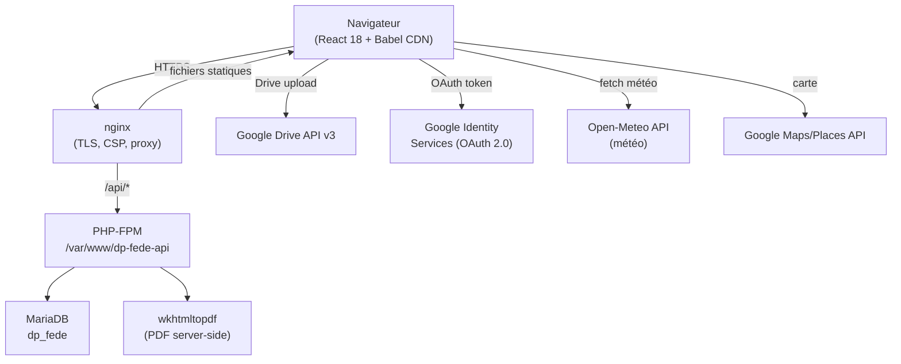
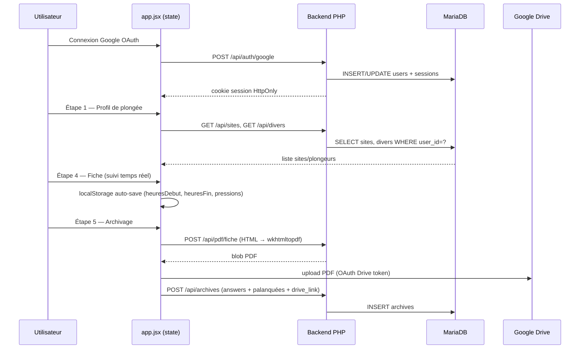
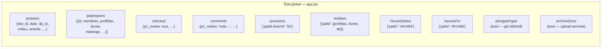
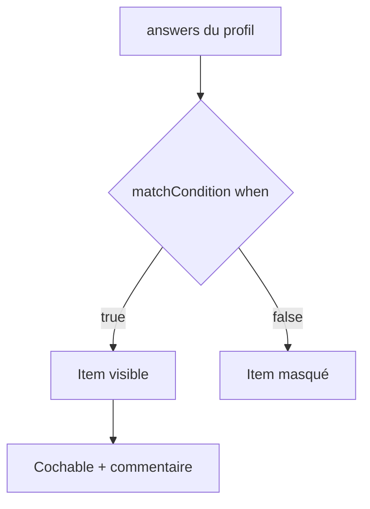
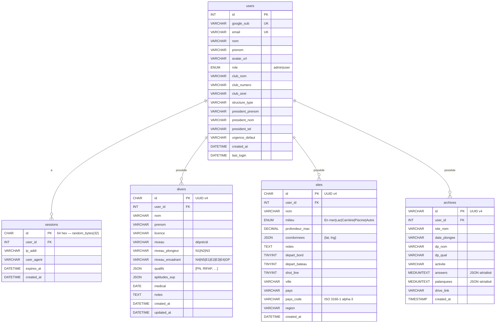
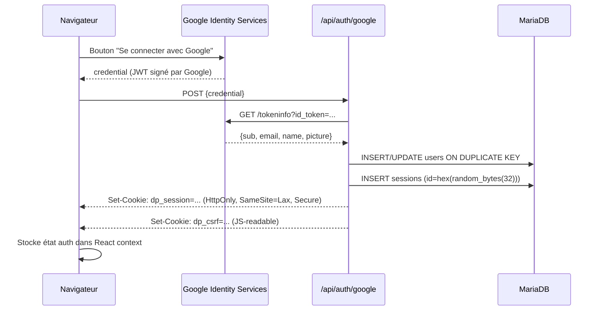
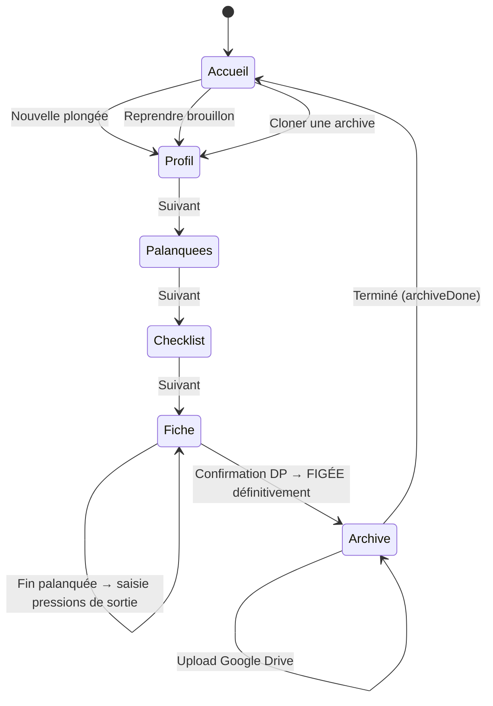

# DP Assistant

Outil d'aide à la décision pour le **Directeur de Plongée (DP)** — conforme au Code du Sport (Art. A322-71 à A322-101) et aux textes fédéraux FFESSM.

Profilage de la plongée, check-list conditionnelle, composition des palanquées par aptitude, fiche de sécurité Art. A322-72, suivi en temps réel et archivage Drive — sur un seul outil accessible depuis un téléphone sur site.

**URL de production :** https://dp-fede.bullesenvalais.ch

---

## Sommaire

- [Technologies](#technologies)
- [Architecture globale](#architecture-globale)
- [Frontend](#frontend)
- [Backend PHP](#backend-php)
- [Base de données](#base-de-données)
- [Authentification](#authentification)
- [Flux de plongée](#flux-de-plongée)
- [Déploiement](#déploiement)
- **[Règles métier détaillées → RULES.md](RULES.md)**

---

## Technologies

### Frontend

| Technologie | Usage | Version |
|---|---|---|
| **React** | UI composants, state management | 18 (CDN) |
| **Babel** | Transpilation JSX in-browser | CDN (`@babel/standalone`) |
| **Google Identity Services** | OAuth 2.0 sign-in + Drive token | GIS SDK |
| **Google Drive API v3** | Upload PDF, gestion dossier `dp-fede` | REST via `fetch` |
| **Open-Meteo API** | Pré-remplissage météo (vent, température) | REST public |
| **Google Maps / Places API** | Sélecteur de carte pour les sites | JS Maps SDK |

> Aucun bundler, aucun build step. Tous les fichiers `.jsx` sont chargés via `<script type="text/babel">` dans `DP Assistant.html`.

### Backend

| Technologie | Usage | Version |
|---|---|---|
| **PHP** | API REST | 7.4 (FPM) |
| **MariaDB** | Persistance | 10.x |
| **wkhtmltopdf** | Génération PDF server-side | installé sur le Pi |
| **nginx** | Reverse proxy + CSP headers | — |
| **APCu** | Rate-limiting login (optionnel) | extension PHP |

### Infrastructure

| Composant | Détail |
|---|---|
| **Serveur** | Raspberry Pi — `pi@bullesenvalais.ch` |
| **Frontend root** | `/var/www/html/dp-fede/` |
| **Backend root** | `/var/www/dp-fede-api/` |
| **Config secrète** | `/etc/dp-fede/config.php` (hors web root, `640 root:www-data`) |

---

## Architecture globale



### Flux de données par écran



---

## Frontend

### Structure des fichiers

```
/
├── DP Assistant.html       ← Point d'entrée unique — charge tous les scripts
├── api.js                  ← Wrapper fetch (CSRF header, JSON, erreurs)
├── auth-context.jsx        ← Context React — Google OAuth, session, logout
├── app.jsx                 ← Shell principal, state global, routing par écran
├── components.jsx          ← Composants partagés (Pill, CdsLink, etc.)
├── data.js                 ← Référentiels métier (niveaux, aptitudes, check-list…)
├── diver-form.jsx          ← Formulaire ajout/édition plongeur
├── styles.css              ← Design system complet (custom properties, layout)
├── logo-ffessm.png         ← Logo FFESSM (58×51 px)
│
├── screen-home.jsx         ← Accueil — historique archives + clone plongée
├── screen-login.jsx        ← Mire de connexion Google
├── screen-profil.jsx       ← Étape 1 — Questionnaire profil de plongée
├── screen-palanquees.jsx   ← Étape 2 — Composition palanquées par aptitude
├── screen-checklist.jsx    ← Étape 3 — Check-list conditionnelle 2 phases
├── screen-fiche.jsx        ← Étape 4 — Fiche Art. A322-72 + suivi temps réel
├── screen-archive.jsx      ← Étape 5 — Export PDF + archivage Google Drive
│
├── screen-archives.jsx     ← Historique (admin) — toutes les plongées
├── screen-account.jsx      ← Mon compte — infos club, urgences
├── screen-admin-divers.jsx ← Admin — annuaire plongeurs
├── screen-admin-sites.jsx  ← Admin — annuaire sites
└── screen-admin-users.jsx  ← Admin — gestion utilisateurs (nicholas.jallan uniquement)
```

### State management (`app.jsx`)

Tout l'état partagé est levé dans `AppInner`. Il est persisté automatiquement dans `localStorage` (clé `dp-assistant-v1`) à chaque modification.



**Règles de verrouillage de navigation :**

| Condition | Étapes verrouillées |
|---|---|
| Une palanquée a commencé (`heuresDebut` non vide) | Étapes 1, 2, 3 |
| Plongée figée (`plongeeFigee = true`) | Étapes 1, 2, 3, 4 |

### Référentiels métier (`data.js`)

| Export `window.*` | Contenu |
|---|---|
| `LEVELS` | Niveaux FFESSM : N1→N5, E1→E4, GP, PE/PA, Baptême |
| `QUALIFICATIONS` | Qualifications complémentaires : NITROX, RIFAP, PADI, … |
| `APTITUDE_MAP` | Mapping niveau → aptitudes `{mandatory[], optional[]}` |
| `DP_DEPTH_RULES` | Prof. max par qualification DP (exploration / formation) |
| `CHECKLIST_RULES` | 2 phases, items conditionnels (voir ci-dessous) |
| `PAL_RULES` | Règles composition palanquée (`maxEnc`, `maxPA`) |
| `STRUCTURE_LABELS` | Labels lisibles pour les types de structure |
| `getMilieuType(milieu)` | Normalise → `'mer'|'lac'|'piscine'|'fosse'` |
| `getProfOptions(dpQual, activite)` | Profondeurs disponibles selon qual. DP |
| `getDiverAptitudes(diver, isExploration)` | Aptitudes selon niveau + contexte |
| `getPalType(membres)` | Type palanquée : `'bapteme'|'formation'|'guidee'|'exploration'` |
| `calcDTR(profMax)` | DTR sans déco : `Math.ceil(profMax / 10)` |
| `matchCondition(when, answers)` | Évalue une condition check-list |
| `sortMembresForFiche(membres)` | Tri encadrant → PE/PA → baptême, serre-file en fin |

#### Check-list conditionnelle

La check-list est générée dynamiquement selon `answers`. Chaque item a un champ `when` qui peut être :
- `undefined` → toujours affiché
- `{key: true}` → affiché si `answers[key]` est truthy
- `function(answers) => bool` → condition personnalisée



**Phase 1 — Préparation (avant arrivée sur site) :** météo, blocs, nitrox/trimix, recycleurs, O₂, trousse, documents, VHF, carburant, shot-line, secours, fiche pré-remplie.

**Phase 2 — Sur site (avant mise à l'eau) :** appel nominatif, briefing, rappels de sécurité (moyen de rappel), composition palanquées, sécurité surface, fiche, pavillon Alpha, échelle, shot-line, nitrox signature, planifs déco, bord d'entrée, décision finale DP.

### Persistance cross-plongée

| Clé localStorage | Contenu | Survit à `startNew()` |
|---|---|---|
| `dp-assistant-v1` | Brouillon complet (answers, palanquées, checked…) | Non (effacée) |
| `dp-rappel-moyen` | Dernier moyen de rappel saisi | **Oui** |

---

## Backend PHP

### Routing (`backend/index.php`)

Tous les fichiers de routes sont inclus séquentiellement. Chaque route utilise `Json::abort()` pour les erreurs et `Json::ok()` pour les succès. Le format de réponse est uniforme :

```json
{ "ok": true, "data": { ... } }
{ "ok": false, "error": "Message d'erreur" }
```

### Routes API

#### `POST /api/auth/google`
Échange un credential Google ID token contre une session PHP.
- Vérifie la signature JWT via `https://oauth2.googleapis.com/tokeninfo`
- Crée ou met à jour l'utilisateur (`users`)
- Premier utilisateur = admin automatique
- Génère un cookie `dp_session` (HttpOnly, SameSite=Lax, Secure) + cookie CSRF `dp_csrf`
- Rate-limited : 10 tentatives / 15 min / IP (APCu)

#### `GET /api/auth/me`
Retourne l'utilisateur connecté (depuis le cookie de session).

#### `POST /api/auth/logout`
Supprime la session en base et expire les cookies.

#### `PATCH /api/auth/account`
Met à jour le profil de l'utilisateur connecté (club, président, urgence).

#### `GET /api/divers`
Liste les plongeurs de l'utilisateur connecté, avec leurs qualifications construites.

#### `POST /api/divers`
Crée un nouveau plongeur. Valide nom, niveau, qualifications.

#### `PUT /api/divers/:id`
Met à jour un plongeur (appartenance vérifiée).

#### `DELETE /api/divers/:id`
Supprime un plongeur (appartenance vérifiée).

#### `GET /api/sites`
Liste les sites de plongée de l'utilisateur connecté.

#### `POST /api/sites`
Crée un site avec coordonnées GPS (JSON), milieu, profondeur max, options départ.

#### `PUT /api/sites/:id` / `DELETE /api/sites/:id`
Mise à jour / suppression (appartenance vérifiée).

#### `GET /api/archives`
Liste les plongées archivées de l'utilisateur (ordre décroissant).

#### `GET /api/archives/:id`
Retourne une archive complète (answers + palanquées JSON parsés).

#### `POST /api/archives`
Enregistre une nouvelle plongée archivée.

#### `POST /api/pdf/fiche`
Reçoit un `html` (rendu React off-screen) + `filename`. Lance `wkhtmltopdf` en subprocess. Retourne le blob PDF.

#### `GET /api/users` (admin)
Liste tous les utilisateurs.

#### `GET /api/users/stats` (admin)
Statistiques agrégées (nombre plongeurs, sites, archives par utilisateur).

#### `PATCH /api/users/:id/role` (admin)
Change le rôle d'un utilisateur (`admin` | `user`).

#### `DELETE /api/users/:id` (admin)
Supprime un utilisateur et toutes ses données (CASCADE).

### Bibliothèques PHP (`backend/lib/`)

| Fichier | Rôle |
|---|---|
| `Config.php` | Lecture de `/etc/dp-fede/config.php` — DB credentials, domain, Google client secret |
| `Db.php` | Singleton PDO MariaDB — connexion + migration automatique au démarrage |
| `Auth.php` | Vérification session, `requireAuth()`, `requireAdmin()` |
| `Csrf.php` | Double-submit cookie — génération + validation du header `X-CSRF-Token` |
| `Json.php` | `Json::ok($data)`, `Json::abort($code, $msg)` |
| `Validate.php` | Validation de champs (longueur, format, enum…) |
| `Smtp.php` | (Réservé — notifications email non activées) |

---

## Base de données

### Schéma complet



### Table `users`

| Colonne | Type | Description |
|---|---|---|
| `id` | INT PK AUTO | Identifiant interne |
| `google_sub` | VARCHAR(255) UNIQUE | Subject Google OAuth — identifiant stable |
| `email` | VARCHAR(255) UNIQUE | Email Google |
| `nom` / `prenom` | VARCHAR(100) | Nom affiché |
| `avatar_url` | VARCHAR(500) | URL avatar Google |
| `role` | ENUM | `'admin'` ou `'user'` — premier inscrit = admin |
| `club_nom` | VARCHAR(200) | Nom du club / structure |
| `club_numero` | VARCHAR(50) | Numéro de club FFESSM |
| `club_siret` | VARCHAR(50) | SIRET ou N° d'entreprise |
| `structure_type` | VARCHAR(20) | `club` / `sca` / `csa` / `autre` |
| `president_prenom/nom/tel` | VARCHAR | Coordonnées président (pour fiche de sécurité) |
| `urgence_defaut` | VARCHAR(20) | Numéro d'urgence local (ex. `144`, `15`) |
| `created_at` | DATETIME | Première connexion |
| `last_login` | DATETIME | Dernière connexion |

### Table `sessions`

| Colonne | Type | Description |
|---|---|---|
| `id` | CHAR(64) PK | 32 octets aléatoires encodés en hex (`random_bytes`) |
| `user_id` | INT FK | Référence `users.id` (CASCADE DELETE) |
| `ip_addr` | VARCHAR(45) | IP client (IPv4 ou IPv6) |
| `user_agent` | VARCHAR(500) | User-Agent navigateur |
| `expires_at` | DATETIME | TTL session (7 jours par défaut) |

### Table `divers`

| Colonne | Type | Description |
|---|---|---|
| `id` | CHAR(36) PK | UUID v4 généré côté PHP |
| `user_id` | INT FK | Propriétaire (CASCADE DELETE) |
| `nom` | VARCHAR(100) | Nom de famille |
| `prenom` | VARCHAR(100) | Prénom |
| `licence` | VARCHAR(50) | Numéro de licence FFESSM |
| `niveau_plongeur` | VARCHAR(3) | Niveau plongeur : `N1`, `N2`, `N3` |
| `niveau_encadrant` | VARCHAR(4) | Niveau encadrant : `E1`→`E4`, `N4`, `N5`, `GP` |
| `qualifs` | JSON | Tableau de qualifications : `["PN","RIFAP","PADI-OW",…]` |
| `aptitudes_sup` | JSON | Aptitudes supplémentaires (recycleur, trimix…) |
| `medical` | DATE | Date du certificat médical |
| `notes` | TEXT | Notes libres du DP |

**Niveaux encadrants reconnus :** `N4` (PA40 guide), `N5` (exploration seule), `E1`→`E4` (moniteurs fédéraux), `GP` (Guide de Palanquée).

**Qualifications reconnues :** `PN` (Plongeur Nitrox), `PN-C` (Nitrox Confirmé), `RIFAP`, `REAN`, `PE-60`, `PADI-OW/AOW/Rescue/DM`, `CMAS-1/2/3`, `BEES1`, `DEJEPS`, `DESJEPS`, `MF1`, `MF2`, `Trimix`, `Recycleur`.

### Table `sites`

| Colonne | Type | Description |
|---|---|---|
| `id` | CHAR(36) PK | UUID v4 |
| `user_id` | INT FK | Propriétaire |
| `nom` | VARCHAR(200) | Nom du site |
| `milieu` | ENUM | `En mer`, `Lac`, `Carrière`, `Piscine`, `Autre` |
| `profondeur_max` | DECIMAL(5,1) | Profondeur maximale du site (mètres) |
| `coordonnees` | JSON | `{"lat": 46.1, "lng": 7.0}` — sélecteur Google Maps |
| `notes` | TEXT | Notes libres |
| `depart_bord` | TINYINT(1) | Départ du bord possible |
| `depart_bateau` | TINYINT(1) | Départ en bateau possible |
| `shot_line` | TINYINT(1) | Shot-line présente sur le site |
| `ville` | VARCHAR(150) | Ville / localité |
| `pays` | VARCHAR(80) | Pays (nom complet) |
| `pays_code` | VARCHAR(3) | Code ISO 3166-1 alpha-3 |
| `region` | VARCHAR(150) | Région / canton |

### Table `archives`

| Colonne | Type | Description |
|---|---|---|
| `id` | VARCHAR(36) PK | UUID v4 |
| `user_id` | INT FK | Propriétaire (sans CASCADE — données conservées) |
| `site_nom` | VARCHAR(255) | Nom du site (dénormalisé pour affichage) |
| `date_plongee` | VARCHAR(50) | Date ISO 8601 (ex. `2026-05-28`) |
| `dp_nom` | VARCHAR(200) | Nom du DP (dénormalisé) |
| `dp_qual` | VARCHAR(20) | Qualification DP (ex. `E3`) |
| `activite` | VARCHAR(50) | `Exploration`, `Enseignement`, `Mixte` |
| `answers` | MEDIUMTEXT | JSON sérialisé du formulaire complet (profil, palanquées…) |
| `palanquees` | MEDIUMTEXT | JSON sérialisé des palanquées enrichies (noms plongeurs) |
| `drive_link` | VARCHAR(500) | URL Google Drive du PDF fiche de sécurité |

#### Contenu JSON `answers` (principaux champs)

```json
{
  "site_id": "uuid",
  "site_nom": "Grotte du Nant",
  "date": "2026-05-28T09:00",
  "dp_id": "uuid",
  "dp_nom": "Dupont Jean",
  "dp_qual": "E3",
  "milieu": "Lac",
  "activite": "Exploration",
  "prof_max": "40 m",
  "depart_bord": true,
  "depart_bateau": false,
  "air": true,
  "nitrox": false,
  "trimix": false,
  "recycleur": false,
  "mineurs": false,
  "handisub": false,
  "etrangers": false,
  "sec_surface": true,
  "sec_surface_membres": ["uuid1"],
  "vhf": false,
  "o2": true,
  "trousse": true,
  "plan_secours": true,
  "eau_potable": true,
  "bouee_surface": true,
  "moyen_rappel": "sondeur",
  "urgence_num": "144",
  "meteo": "Vent NE 10 km/h, bonne visibilité",
  "fiche_observations": "RAS",
  "heuresDebut": { "palId": "09:15" },
  "heuresFin":   { "palId": "10:05" }
}
```

#### Contenu JSON `palanquees` (exemple)

```json
[
  {
    "id": "uuid-pal",
    "profMax": 35,
    "duree": 40,
    "dtr": 4,
    "melange": "Air",
    "no_deco": true,
    "shot_line": false,
    "membres": [
      {
        "diverId": "uuid-diver",
        "aptitude": "E2",
        "nom": "MARTIN",
        "prenom": "Sophie",
        "licence": "12345678"
      }
    ]
  }
]
```

---

## Authentification



**Protection CSRF :** double-submit cookie. Le cookie `dp_csrf` est lisible par JS ; toutes les requêtes `POST/PUT/PATCH/DELETE` doivent envoyer sa valeur dans le header `X-CSRF-Token`. Le backend vérifie la concordance.

---

## Flux de plongée



### États de verrouillage

| État | Déclencheur | Effet |
|---|---|---|
| **Plongée en cours** | Première palanquée avec `▶ Début` | Étapes 1, 2, 3 verrouillées (🔒). Auto-sauvé dans localStorage. |
| **Plongée figée** | Confirmation DP dans la popup d'archivage | Étapes 1→4 verrouillées définitivement. `plongeeFigee = true` persisté. |
| **Archive terminée** | `doArchive()` réussi | Bouton "Terminé" activé → retour accueil + `startNew()` |

---

## Déploiement

### Frontend

```bash
rsync -av --rsync-path="sudo rsync" \
  --exclude='.git' --exclude='backend/' \
  /Users/nicholas/projects/dpchecklist/ \
  pi@bullesenvalais.ch:/var/www/html/dp-fede/

ssh pi@bullesenvalais.ch "sudo chown -R www-data:www-data /var/www/html/dp-fede && \
  sudo cp '/var/www/html/dp-fede/DP Assistant.html' /var/www/html/dp-fede/index.html && \
  sudo chown www-data:www-data /var/www/html/dp-fede/index.html"
```

### Backend PHP

```bash
rsync -av --rsync-path="sudo rsync" \
  /Users/nicholas/projects/dpchecklist/backend/ \
  pi@bullesenvalais.ch:/var/www/dp-fede-api/

ssh pi@bullesenvalais.ch "sudo chown -R www-data:www-data /var/www/dp-fede-api"
```

> Ne jamais déployer `backend/config.php` (gitignored). La config live sur le Pi dans `/etc/dp-fede/config.php`.

### Nginx — après modification

```bash
ssh pi@bullesenvalais.ch "sudo nginx -t && sudo systemctl reload nginx"
```

### CSP — origines whitelistées dans `connect-src`

Toute nouvelle API externe appelée via `fetch()` doit être ajoutée à `connect-src` dans `/etc/nginx/sites-available/bullesenvalais` (bloc `dp-fede`).

| Origine | Usage |
|---|---|
| `'self'` | API backend |
| `https://maps.googleapis.com` | Google Maps + Places |
| `https://maps.gstatic.com` | Assets Maps |
| `https://api.open-meteo.com` | Météo (bouton précomplétion) |
| `https://www.googleapis.com` | Google Drive API v3 |
| `https://oauth2.googleapis.com` | Token endpoint OAuth Drive |
| `https://accounts.google.com` | Google Identity Services |

### Google OAuth

- **Client ID :** `813155202106-jlddu3nmfuq552p9673odcegrf5kuke7.apps.googleusercontent.com`
- **GCP Project :** `api-project-813155202106`
- **Scopes demandés :** `openid email profile` (login) + `https://www.googleapis.com/auth/drive.file` (upload PDF)

---

## Avertissement légal

Outil d'aide à la décision. Ne se substitue pas à la responsabilité personnelle du Directeur de Plongée, ni à la lecture du Code du Sport (Art. A322-71 à A322-101) et des textes fédéraux FFESSM en vigueur.
